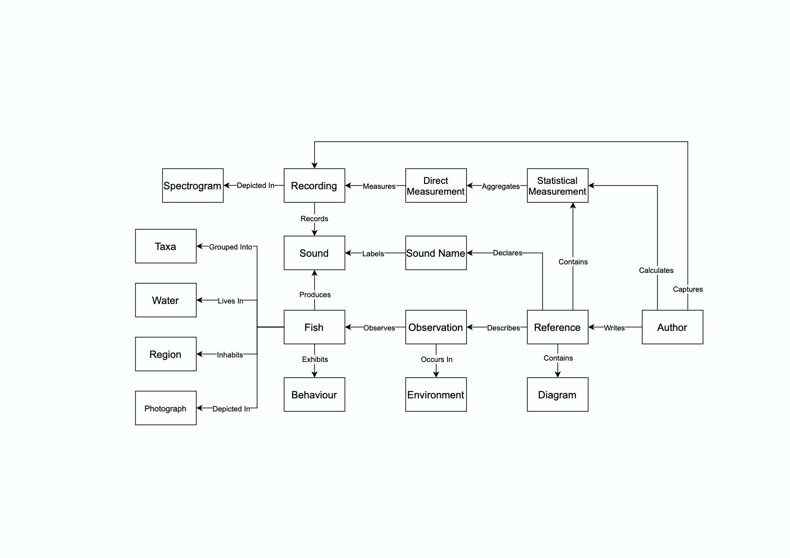

# FishSounds

This repository contains the code used to create the website [FishSounds](https://fishsounds.net), an online catalogue of research and recordings related to the noises that fish make. In line with FAIR principles, this code has been made publicly available so it may be reused by others with similar data and product goals.

This repo currently offers the outdated Version 1 of the catalogue code, and does not have numerous feature additions and bug fixes present in the live catalgoue. Updates will be made to this code base when v2.1 of the live catalogue launches in late 2023.

Note that if you are seeking the data used in FishSounds (rather than the code), it is available for bulk download through [Dataverse](https://doi.org/10.5683/SP2/TACOUX).

## License
The code in this repository is licensed under a [GNU General Public License version 3](https://opensource.org/licenses/GPL-3.0).

Please refer to the licenses for libraries included in the public/libraries folder for information on their use.

## Platform Dependencies
- Ubuntu (18.04) - [installation guidelines](https://ubuntu.com/tutorials/install-ubuntu-server#1-overview)
- MongoDB Community Edition (13.x) - [installation guidelines](https://docs.mongodb.com/manual/installation/#mongodb-community-edition-installation-tutorials)
- Node.js (13.12.x) - [installation guidelines](https://nodejs.org/en/download/)
- NPM (6.14.x) - [installation guidelines](https://docs.npmjs.com/downloading-and-installing-node-js-and-npm)

## Environment Configuration
1. Ensure all dependencies (above) are installed and configured
1. Clone the repository to the desired folder location
1. Use NPM to install the following library dependencies:
    - connect
    - mongoose
    - qs
    - colormap
    - uuid
    - pm2
1. Rename the file keys-blank.json to keys.json, and edit it to insert the applicable values:
    - hostname - the IP address for the site (e.g. 127.0.0.1)
    - port - the port through which the site should be accessible (e.g. 3000)
    - databaseName - the name of the database holding the site’s data in MongoDB
    - databaseUser - the username for the related MongoDB database
    - databasePassword - the password for the related MongoDB database
1. Run `mongorestore --db={databaseName} --username={databaseUser} dump` (exchanging the bracketed values; entering the database password if prompted). This will populate the database with a sample data set.
1. Run `node app.js` from within the file directory to initialize the application
1. Use PM2 commands ([guide](https://pm2.keymetrics.io/docs/usage/quick-start/)) to run the application persistently

## Initial Setup
The app should run with no additional setup required, and should be accessible through a browser at the hostname and port declared in keys.json. The following files contain placeholder text or images and will need to be added or modified:
- /siteLogo.png
- /funderLogo.png
- /views/index.js : welcome box text
- /views/about.js : data objects at top of file; section introduction text throughout
- /views/how-to-cite.js
- /public/about-images/ : add person images and organization logos for About page

## Application Structure
- Fish-sounds
    - Dump - container folder for database copies
        - Demo - core tables and test data for the app
    - Public - image files and code libraries
        - Images - pictures of fish species
        - Libraries - a collection of imported code libraries
            - Chosen - library for styling dropdown lists
            - Circle-player - library for creating a stylized audio-player
        - Recordings
            - Audios - .wav files for each audio recording
            - Images - .jpg files of spectrograms depicting each audio recording
    - Schemas - data models and CRUD functionality
    - Views - interface design files
        - Tools - utility files with functions used across multiple views

### Key Files:
- app.js - controller file that runs the app and routes all requests
- keys.json - configuration file used to declare hostnames, database credentials, etc.

## Data Structure
The following entity relationship diagram describes how the data entities included in FishSounds interact:

### Data Schemas:
- fish - fish taxa and metadata describing environment
    - Joins: term (water, region, climate)
- observation - metadata describing what a given reference observed about a given fish species
    - Joins: fish; reference; term (behaviour, environment, source, diagram, noise)
- recording - audio and image filenames and metadata for a recording of a fish species, including related references 
    - Joins: fish; reference (citations, additionalRefs); term (noise)
- reference - publication citation information
- term - collection of controlled vocabularies such as regions, behaviours, and sound names

### Common Schema Functions:
- read - takes a system ID, returns a human-readable object
- search - takes search parameters, performs aggregate searching across object types, returns list of matching objects
- find - takes (array of) text value and term type, returns (array of) system ID
- getId - takes a public ID (used in URLs), returns a system ID (used in DB)
- getIdByName - takes a text value for a distinct field (e.g. scientific name), returns a system ID
- getList - takes a partial text value, returns a list of values matching it (used to populate auto-suggestions)
- getLatest - returns metadata from the last entered record (used for site statistics)
- getCount - returns the number of records in the database (used for site statistics)

